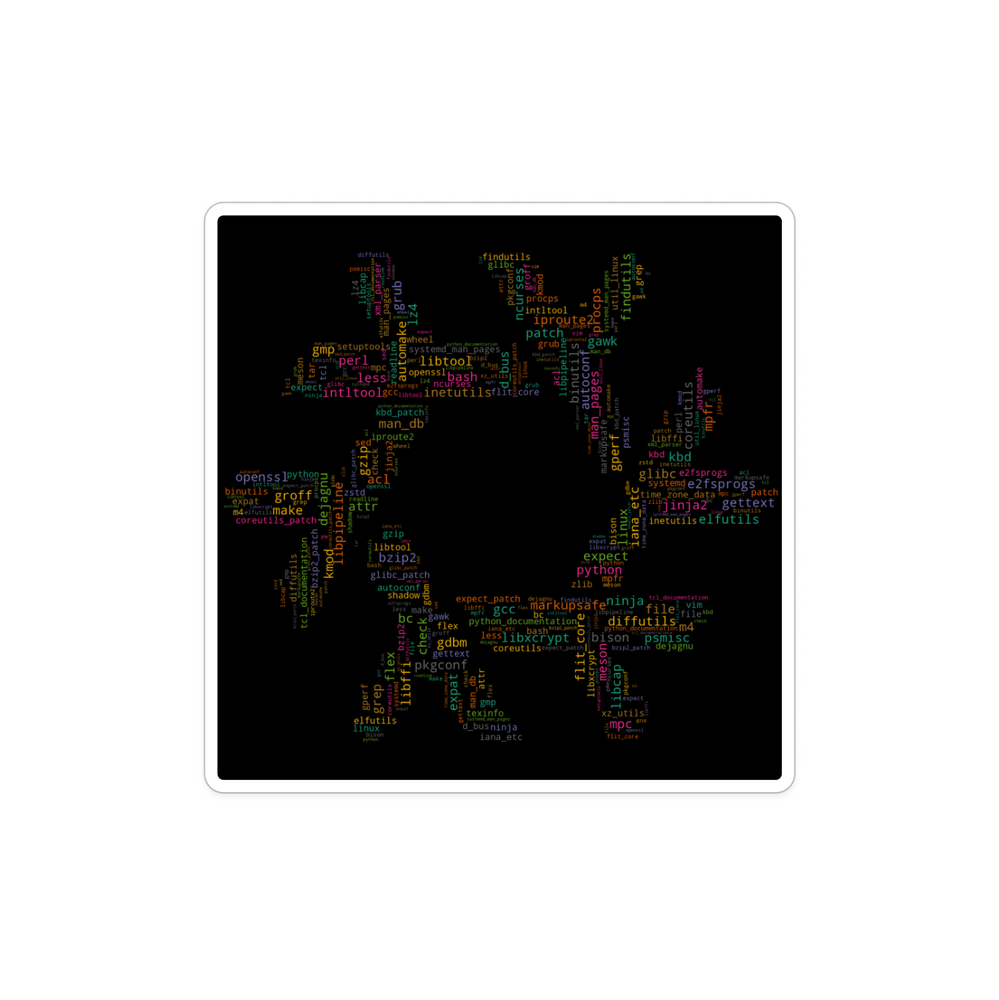

# NixLFS: Linux from Scratch... from Nix
#### Based on [LFS 12.2 - systemd](https://www.linuxfromscratch.org/lfs/downloads/12.2-systemd/) version

## Overview
This project builds "Linux from Scratch" (LFS) on a Nix-based, x86 system, following the [LFS project](https://www.linuxfromscratch.org)'s guidance. It's an adaptation of LFS 12.2 (systemd version) for a Nix environment.

### Key Differences in Approach

Unlike traditional LFS, which relies on a standard Linux environment and often uses `chroot` to protect the host system during builds, NixLFS utilizes Nix's native sandboxing. This isolates the build environment completely from the host system's packages, leveraging NixOS's unique filesystem hierarchy centered around the Nix store.

**Trade-offs:**
- **Storage Intensity:** NixLFS is storage-intensive. It builds each stage independently. The output of one stage is used as an input of the next stage. This results in a significant storage footprint. If troubleshooting an issue with many iterations of rebuilds and without regular garbage collection, disk space utilization could exceed 25GB.
- **Time intensity**: The build time of each stage is longer than that of building manually as the derivation handles inputs and outputs as unique to each stage. However, an overall time advantage is gained through the full automation of the entire build process. 

### Initial Setup

#### Source list
LFS provides a [list of sources](https://www.linuxfromscratch.org/lfs/downloads/stable-systemd/wget-list) needed for the build. [BLFS](https://www.linuxfromscratch.org/blfs/view/stable-systemd/index.html) is an additional body of work for extending LFS builds.

NixLFS uses a JSON file to store the sources and patches needed for the build. See `lfs_sources.json` for the sources used in this run. Since Nix utilizes sha256 hashes to verify inputs used in a derivation (enhancing reproducibility), `lfs_hashes.json` stores the proper sha256 hashes for each source in the sources JSON. The current build also utilizes a few BLFS sources as inputs.

To update these input files:

- Generate `./lfs_sources.json` with the latest sources by running: `python ./tools/get_sourcelist.py`. _Note: the list generated is not version controlled. It will pull the last list published for stable-systemd and will require cross checking the latest stable-release LFS guide to fine-tune build instructions for any source version changes.
- Next, run `chmod +x ./tools/prefetch_sources.sh && ./tools/prefetch_sources.sh ./lfs_sources.json ./lfs_hashes.json`. This will prefetch all sources, unpacking when necessary, and will generate the corresponding sha256 hash needed for each source during the build.
- For any selected BLFS additions, add the appropriate sources to `./blfs_source.json` (and proper Nix expressions to `flake.nix` and in `derivations/sys_software`).
- Then run `./tools/prefetch_sources.sh ./blfs_sources.json ./blfs_hashes.json` to prefetch and generate sha256 for BLFS sources.

#### Checksums
While LFS uses md5 checksums to verify integrity of packages, Nix does not use md5. Instead we fetch the sha256 values from the packages. These hashes can be found in `source_hashes.json`. Hashes for the sources can be generated by running the nix-prefetch-url tool via `./tools/prefetch_sources.sh <input JSON> <output JSON>`.

### Modifications
- **Kernel configurations**: The kernel configuration used in this build is located at `./kconfig/.config`. The current `.config` follows LFS guidance with additional configurations from BLFS for UEFI and NVME.  This kernel configration file is imported during the kernel build at `./derivations/sys_conf/linuxkernel.nix`. Any modifications make to this `.config` prior to running NixLFS will directly affect the kernel build and the final system output. 

- **LFS Permissions**: Nix sandboxing prevents handling of most permissions modifications within the build environment. As a work around, wrappers are applied beginning from fhs/fhsbuild.nix. These wrappers log chmod/chgrp/chown calls during build of the LFS system. These logs were parsed after completion of the kernel build and generalized. LFS system permissions are applied outside of the Nix environment using the `./lfs_script.sh` bash script (specifically `chmod +x ./lfs_script.sh && ./lfs_script.sh --set-perms`)

## Running NixLFS
**Prerequisites:** Enable Flakes and nix-command experimental features in Nix. If you wish to verify your build without rebooting, QEMU will be necessary.

### LFS Setup
Clone the repository and prepare the filesystem:
```bash
git clone https://github.com/cloudripper/NixLFS.git
cd NixLFS
```
Prepare and mount an LFS partition as described in Part II of the LFS Guide. Optional: On NixOS, you can persist the mount by adding the following to your `hardware-configuration.nix`:
```nix
# Optional
# /etc/nixos/hardware-configuration.nix
fileSystems."/mnt/lfs" = {
    device = "/dev/disk/by-uuid/<partition UUID>";
    fsType = "ext4";
};
```

### Build Process
Run the build script to build LFS and populate/set up the LFS environment in /mnt/lfs partition:
```bash
sudo ./lfs_script.sh --setup-env
```
This script:
1. Completes the full build (approximately 5 hours on an 8-core processor).
2. Copies the final output to `/mnt/lfs`.
3. Applies permission corrections within the `/mnt/lfs` chroot.
4. Configures shadow settings within chroot.

Enter LFS:
```bash
# Boot build
sudo ./lfs_script.sh --enter-qemu # if you have issue, verify proper root is used at lfs_script.sh:77

# Chroot only
sudo ./lfs_script.sh --enter-chroot
```

### Booting into LFS
The easiest way to verify a successful, bootable LFS build is with QEMU (via the `lfs_script` above).

For a hardware boot, if using Grub on NixOS with `useOSProber` set to true, Grub should automatically detect the LFS OS. Enable this by adding to your `configuration.nix`:
```nix
boot.loader.grub.useOSProber = true;
```

### Manual Build Process
In order to manually run the build process, use the _nix build_ command

LFS chapter sections are broken up into individual derivative stages. These can be found in the derivations directory.
- Chapter 5 ("crossToolchain") stages are defined under cross_toolchain, these stages (and all preceding stages) are built by calling: ```nix build .#crossToolchain.<stage>```
- Chapter 6 ("crossTempTools") under temp_tools, these stages (and all preceding stages) are built by calling: ```nix build .#crossTempTools.<stage>```
- Chapter 7 ("fhs") is under fhs, these stages (and all preceding stages) are built by calling: ```nix build .#fhs.<stage>```
- Chapter 8 ("ss") is under sys_software, these stages (and all preceding stages) are built by calling: ```nix build .#ss.<stage>```
- Chapter 9 and Chapter 10 ("sysconf") stages are under sys_conf, these stages (and all preceding stages) are built by calling: ```nix build .#sysconf.<stage>```


```bash
# To build the entire LFS
nix build .#

# To build to a specific chapter/stage: nix build .#<chapter>.<stage>
# for example, to build the enter cross toolchain described in chapter 5 and get the path to the output, run
nix build .#crossToolchain.default --print-out-paths

# To build all stages up to and including the GCC2 build (in chapter 8) and get the path:
nix build .#ss.gcc --print-out-paths

# See flake.nix for more details.
```

#### Troubleshooting:

The biggest issue with troubleshooting in NixLFS is to identify the approximate cause of the bug. This can be complex. Since the build workflow follows the LFS book, performing a search in the book for key libs or packages of concern might point in a reasonable location. For instance, if you find a bash 'not found' issue toward the end of the build, you look to the bash section in Chapter 8 and review its build configuration settings and it's corresponding dependencies. Then, you can focus your attention on the bash derivation and the derivations of its dependencies. 

Three main methods of debugging have been useful in this project

###### 1. Echo debugging

Inserting `echo` and similar commands in mkDerivation phases (*see .nix files in `./derivation`*) is an invaluable way to glean internal state from outside a build environment. In order to get the feedback faster, following these debugging commands with an `exit 1` statement. `exit 1` will terminate the build with an error, providing additional output. You may also review the failed build logs by running  the `nix logs /nix/store-HASH.drv` command that is provided on fail. 

Echo debugging can get a little more difficult when entering `fhs` and `ss` stages of the build, since the mkDerivation logging further contained in the buildFHSEnv environment.

###### 2. Output verification

The output of a successful build is stored in the `/nix/store`. When a build completes, `./result` is also created as a symbolic link to the corresponding output location in the /nix/store. This allows you to easy access and review the output content. However, when a build fails, no output is generated. The benefit of the stages build in NixLFS is that the input of a derivation is the (successful) output from the previous stage's build. So to get a sense of the inputs used by the problematic derivation, you can verify the build output of the previous stage.

For instance, if you are having an issue with building perl (for the first time as an additional temp tool (`fhs.perl`), you know from referencing either the LFS  book (system software, Chapter 7) or the flake.nix, then it is clear that inputted to the `fhs.perl` derivation are the preceeding outputs of `fhs.bison`. if you run:

```bash
nix build .#fhs.bison
```

the the output of the `fhs.bison` can be accessed and analyzed in `./result`. 

In a similar fashion, outputs can be backtracked to determine the last known point of success. 

###### 3. Entering the development environment for a stage

If you need to debug more in the environment itself, the development environment for a derivation can be entered by running. This is useful in verifying the environment variables that the build environment is using:
```bash
nix develop .#<chapter>.<stage>
```

#### Additional Note:
- The NixLFS workflow is only verified to work up to Nix 24.05 stable (specifically prior to [PR 341219](https://github.com/NixOS/nixpkgs/pull/341219)). Breaking changes to buildFHSEnv in 24.11 make the current design of NixLFS infeasible. 
